

# 2026-04-21 Initial Baseline Snapshot

**Curated current-state report for the repository's maintained benchmark surface, built from one repeated raw snapshot and summarized into family-level charts.**

[Report Map](#report-map) · [Question](#question) · [Environment](#environment) · [Evidence](#evidence) · [Findings](#findings) · [Interpretation](#interpretation) · [Follow-up](#follow-up)

Snapshot only · No revision comparison · Charts summarize repeated raw samples

**Related docs:** [Performance overview](../README.md) · [Methodology](../methodology.md) · [Benchmark matrix](../benchmark-matrix.md) · [Interpretation guide](../interpretation-guide.md)

## Report map

- [Question](#question)
- [Scope](#scope)
- [Environment](#environment)
- [Evidence](#evidence)
- [Raw Artifacts](#raw-artifacts)
- [Benchmark Sources](#benchmark-sources)
- [Snapshot Summarization](#snapshot-summarization)
- [Findings](#findings)
- [Backend](#backend)
- [Baselines](#baselines)
- [Paths](#paths)
- [Shapes](#shapes)
- [Parallel](#parallel)
- [Metrics](#metrics)
- [Interpretation](#interpretation)
- [Limits](#limits)
- [Follow-up](#follow-up)

## Question

What does the current benchmark surface of `arcoris.dev/pool` look like when
captured as one repeated raw benchmark snapshot and summarized into curated
family-level charts?

## Scope

This report documents one current-state baseline snapshot.

It covers these benchmark families:

- backend
- baselines
- paths
- shapes
- parallel
- metrics

It does not compare revisions.
It does not establish regression or improvement between commits.

Two metric layers appear in this report:

- core benchmark metrics such as `ns/op`, `B/op`, and `allocs/op`;
- repository-specific lifecycle counters such as `news/op`, `drops/op`, and
  `reuse_denials/op`.

Not every family exposes the same counter set.
Backend and baseline charts focus on backend misses and baseline allocation
surfaces, so they do not need drop or reuse-denial counters.
The paths, shapes, parallel, and metrics families include those counters where
the benchmarked policy path can actually reject or drop values.

## Environment

Primary artifacts:

- raw benchmark output:
  [Initial baseline raw benchmark snapshot](../../../bench/raw/initial-baseline.txt)
- environment capture:
  [Initial baseline environment capture](../../../bench/raw/initial-baseline.env.txt)

Recorded environment:

- Git revision: `81d38e0bad5847155bb71d32c6718be12a69469d`
- Go version: `go version go1.25.9 linux/amd64`
- OS: `linux`
- Architecture: `amd64`
- CPU: `AMD Ryzen 7 7840HS w/ Radeon 780M Graphics`
- Logical CPUs: `16`
- `GOMAXPROCS`: `default`
- Collection command:
  `go test -run '^$' -bench '^(BenchmarkSyncPool_|BenchmarkBaseline_|BenchmarkPaths_|BenchmarkShapes_|BenchmarkParallel_|BenchmarkCompare_|BenchmarkMetrics_)' -benchmem -count 10 ./...`

Toolchain note:
this snapshot was collected on the repository's preferred `go1.25.9`
toolchain. That keeps the raw artifact, charts, and report aligned with the
repository's stated version policy.

## Evidence

This report relies on one repeated raw snapshot plus curated presentation
artifacts derived from that snapshot.

### Raw artifacts

- [Initial baseline raw benchmark snapshot](../../../bench/raw/initial-baseline.txt)
- [Initial baseline environment capture](../../../bench/raw/initial-baseline.env.txt)

### Benchmark sources

| Family | Benchmark source | What it defines |
| --- | --- | --- |
| backend | [Backend benchmark source](../../../internal/backend/syncpool_benchmark_test.go) | lower-bound typed backend cases |
| baselines | [Package baseline benchmark source](../../../pool_baseline_benchmark_test.go) | allocation, raw `sync.Pool`, and public-runtime baselines |
| paths | [Lifecycle-path benchmark source](../../../pool_paths_benchmark_test.go) | accepted, rejected, reset-heavy, and drop-observed return paths |
| shapes | [Shape benchmark source](../../../pool_shapes_benchmark_test.go) | pointer-like, value-type, and oversized-rejected shape cases |
| parallel | [Parallel benchmark source](../../../pool_parallel_benchmark_test.go) | realistic concurrent public-runtime and raw `sync.Pool` cases |
| metrics | [Metrics benchmark source](../../../pool_metrics_benchmark_test.go) | repository-specific per-op counter workloads |

### Snapshot summarization

This report is based on one raw snapshot file that contains repeated benchmark
samples.

The chart generation step summarized that raw file as follows:

- aggregation mode: `median`
- grouping: `benchmark family + metric`
- default family exclusion: `BenchmarkCompare_*` omitted from snapshot charts

This matters because the raw file contains repeated samples from `-count 10`.
The charts in this report therefore show one representative value per benchmark
and metric, not every raw line from the artifact.

## Findings

### Backend

Backend charts answer the narrowest storage-layer question in the repository:
what does the typed internal backend cost before lifecycle policy is layered on
top?

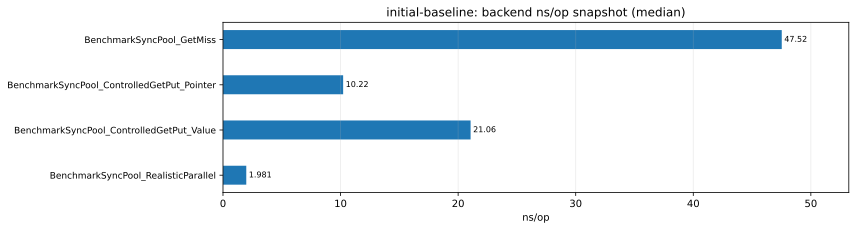

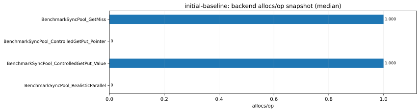

- `BenchmarkSyncPool_GetMiss`: `~47.5 ns/op`, `24 B/op`, `1 alloc/op`,
  `1.0 news/op`.
  This is the pure constructor-miss path. Every `Get` falls through to the
  backend constructor, so the result is the benchmark's clearest statement of
  miss cost rather than reuse cost.
- `BenchmarkSyncPool_ControlledGetPut_Pointer`: `~10.2 ns/op`, `0 B/op`,
  `0 allocs/op`, `0 news/op`.
  This is the intended pointer-like controlled steady-state backend path.
  In this snapshot it establishes the lowest serial backend reuse cost in the
  report.
- `BenchmarkSyncPool_ControlledGetPut_Value`: `~21.1 ns/op`, `32 B/op`,
  `1 alloc/op`, `0 news/op`.
  The by-value path is about `2.1x` slower than the pointer-like backend path
  and introduces allocation pressure even though constructor misses are absent.
  That makes the shape penalty visible at the backend layer before the public
  runtime is even involved.
- `BenchmarkSyncPool_RealisticParallel`: `~2.0 ns/op`, `0 B/op`,
  `0 allocs/op`, `0 news/op`.
  This is a realistic parallel backend view with a warm backend. It should not
  be ranked directly against the serial controlled cases, because it belongs to
  a different execution class. What matters here is that the backend stayed on
  the pure reuse path in this snapshot and did not surface constructor misses
  under the measured parallel load.

Backend summary:
the internal backend is cheap on the pointer-like reuse path, miss cost is
clearly more expensive than hot reuse, and value-oriented usage already shows a
shape penalty before any public lifecycle orchestration is added.

### Baselines

Baseline charts are the public-runtime comparison surface of the snapshot.
They answer the most practical question in the report: how does the package sit
between plain allocation and direct `sync.Pool` for the benchmarked shapes?

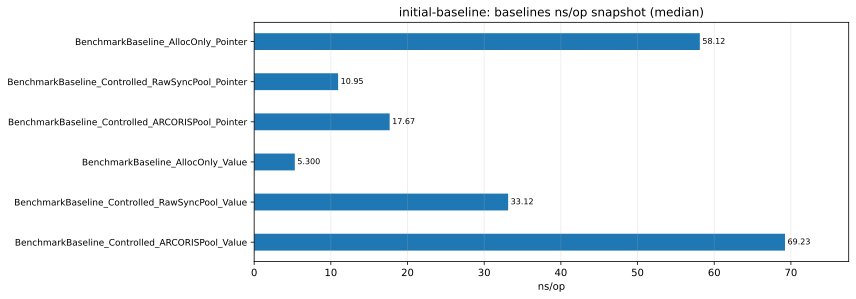

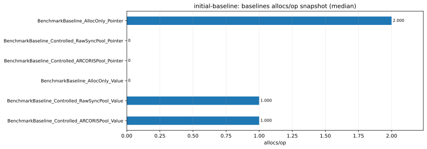

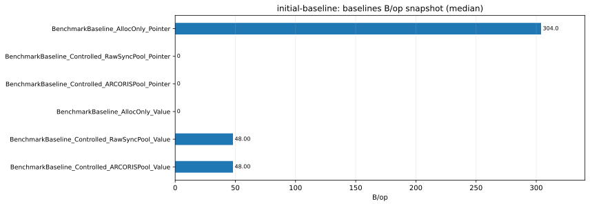

- `BenchmarkBaseline_AllocOnly_Pointer`: `~58.1 ns/op`, `304 B/op`,
  `2 allocs/op`, `1.0 news/op`.
  This is the plain fresh-allocation pointer baseline. It is the most
  allocation-heavy pointer case in the family and acts as the "no pooling"
  reference for pointer-like temporary objects.
- `BenchmarkBaseline_Controlled_RawSyncPool_Pointer`: `~11.0 ns/op`,
  `0 B/op`, `0 allocs/op`, `0 news/op`.
  This is the direct `sync.Pool` pointer hot path. It is about `5.3x` faster
  than the plain-allocation pointer case in this snapshot and removes both the
  constructor rate and the allocation surface.
- `BenchmarkBaseline_Controlled_ARCORISPool_Pointer`: `~17.7 ns/op`,
  `0 B/op`, `0 allocs/op`, `0 news/op`.
  This is the public-runtime pointer hot path. It stays allocation-free and
  miss-free, but sits about `1.6x` above the raw `sync.Pool` pointer baseline.
  That is the cleanest pointer-like serial overhead view in this snapshot.
- `BenchmarkBaseline_AllocOnly_Value`: `~5.3 ns/op`, `0 B/op`,
  `0 allocs/op`, `1.0 news/op`.
  This is the plain construction value baseline. For this small by-value shape,
  direct construction is extremely cheap and remains stack-friendly in the
  recorded run.
- `BenchmarkBaseline_Controlled_RawSyncPool_Value`: `~33.1 ns/op`, `48 B/op`,
  `1 alloc/op`, `0 news/op`.
  Pooling the value shape is materially slower than direct construction and
  still allocates. This makes the value-type mismatch visible even on the raw
  `sync.Pool` baseline.
- `BenchmarkBaseline_Controlled_ARCORISPool_Value`: `~69.2 ns/op`,
  `48 B/op`, `1 alloc/op`, `0 news/op`.
  This is the clearest "do not generalize pooling benefits to every `T`"
  result in the report. The public runtime preserves the same one-allocation
  value path and is about `2.1x` slower than the raw `sync.Pool` value case for
  this shape.

Baseline summary:
the pointer-like baseline behaves the way the package is designed to behave:
public-runtime pooling is slower than raw `sync.Pool`, but much cheaper than
fresh allocation and it removes allocation pressure entirely.
The small by-value baseline shows the opposite: pooling is a poor fit for this
shape, and direct construction remains the cheapest path.

### Paths

The path family isolates lifecycle semantics instead of treating "pool cost" as
one flat number.
This is the family that makes accepted reuse, rejection, heavy reset, and
drop-path work readable as separate cases.

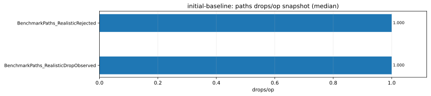

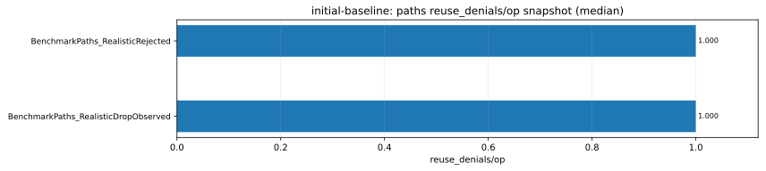

- `BenchmarkPaths_ControlledAccepted`: `~16.7 ns/op`, `0 B/op`,
  `0 allocs/op`, `0 news/op`.
  This is the controlled accepted steady-state path. It is the serial hot-path
  reference for the lifecycle family.
- `BenchmarkPaths_RealisticAccepted`: `~15.6 ns/op`, `0 B/op`,
  `0 allocs/op`, `0 news/op`.
  This is the same accepted path under the ordinary serial runtime. In this
  snapshot it remains very close to the controlled accepted case, which means
  the accepted path stayed stable even without the single-P, GC-disabled
  harness.
- `BenchmarkPaths_RealisticRejected`: `~109.6 ns/op`, `304 B/op`,
  `2 allocs/op`, `1.0 news/op`, `1.0 drops/op`, `1.0 reuse_denials/op`.
  This is the always-rejected serial path with cheap drop observation. Every
  operation constructs a new value, denies reuse, and drops the value once.
  The path is about `7.0x` slower than the realistic accepted case.
- `BenchmarkPaths_ControlledResetHeavy`: `~2121 ns/op`, `0 B/op`,
  `0 allocs/op`, `0 news/op`.
  This benchmark exists to make reset cost dominate the path. The result does
  exactly that: the path is roughly `127x` slower than the controlled accepted
  case while staying allocation-free. The cost here is reset work, not miss
  pressure.
- `BenchmarkPaths_RealisticDropObserved`: `~122.9 ns/op`, `304 B/op`,
  `2 allocs/op`, `1.0 news/op`, `1.0 drops/op`, `1.0 reuse_denials/op`.
  This is the rejected serial path with intentionally heavier `OnDrop` work.
  It lands slightly above the cheaper rejected path, which is consistent with
  the benchmark design: the extra cost comes from work performed while
  observing the dropped value.

Path summary:
accepted reuse is cheap and stable in this snapshot, while rejection turns the
path into a constructor-and-drop loop.
The reset-heavy benchmark shows that lifecycle hooks can dominate total cost
even when the backend and allocation surface are not the bottleneck.

### Shapes

The shape family exists to stop one benchmark shape from standing in for all
possible `T`.
Its results show where pointer-like reuse remains cheap, where retained slices
start to matter, and where by-value or oversized shapes push the package away
from its intended primary path.

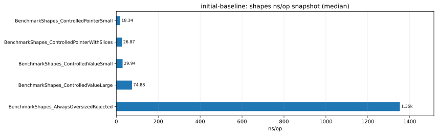

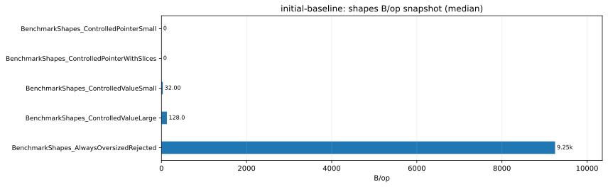

- `BenchmarkShapes_ControlledPointerSmall`: `~18.3 ns/op`, `0 B/op`,
  `0 allocs/op`, `0 news/op`.
  This is the compact pointer-like reference shape for the family.
- `BenchmarkShapes_ControlledPointerWithSlices`: `~26.9 ns/op`, `0 B/op`,
  `0 allocs/op`, `0 news/op`.
  Retained slices make the pointer-like path about `1.47x` slower than the
  smallest pointer case, but the path remains allocation-free and still looks
  like a strong reuse candidate.
- `BenchmarkShapes_ControlledValueSmall`: `~29.9 ns/op`, `32 B/op`,
  `1 alloc/op`, `0 news/op`.
  The small by-value shape is already slower than both pointer-like cases and
  introduces one allocation per operation. This reinforces the baseline-family
  message that by-value pooling is not the repository's primary target.
- `BenchmarkShapes_ControlledValueLarge`: `~74.9 ns/op`, `128 B/op`,
  `1 alloc/op`, `0 news/op`.
  Increasing value size makes the value-path penalty much clearer. The larger
  value shape is about `2.5x` slower than the small value case and `4.1x`
  slower than the compact pointer-like reference.
- `BenchmarkShapes_AlwaysOversizedRejected`: `~1353 ns/op`, `9248 B/op`,
  `3 allocs/op`, `1.0 news/op`, `1.0 drops/op`, `1.0 reuse_denials/op`.
  This benchmark is intentionally not a warm accepted path. Every iteration
  crosses the reuse threshold, so the path becomes a large allocate-grow-drop
  cycle. It is the clearest example in the report of a shape that pooling
  should not try to retain.

Shape summary:
pointer-like shapes remain the healthy reuse path.
By-value shapes get worse as copy size grows, and always-oversized shapes are
explicit rejection workloads rather than realistic reuse candidates.

### Parallel

The parallel family is the repository's realistic concurrent view.
It should not be compared directly to the controlled serial families.
Its job is to show what happens under `RunParallel`, not to chase the smallest
possible serial hot-path number.

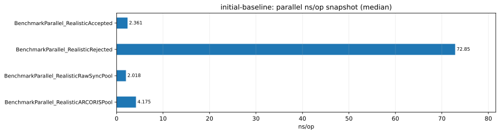

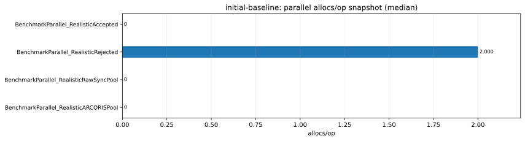

- `BenchmarkParallel_RealisticAccepted`: `~2.36 ns/op`, `0 B/op`,
  `0 allocs/op`, `0 news/op`.
  This is the accepted public-runtime parallel path for the `parallelAccepted`
  shape. In this snapshot it stays entirely on the reuse path.
- `BenchmarkParallel_RealisticRejected`: `~72.9 ns/op`, `288 B/op`,
  `2 allocs/op`, `1.0 news/op`, `1.0 drops/op`, `1.0 reuse_denials/op`.
  This is the concurrent rejected public-runtime path. It is about `30.9x`
  slower than the accepted parallel path and turns every operation into one
  constructor plus one drop.
- `BenchmarkParallel_RealisticRawSyncPool`: `~2.02 ns/op`, `0 B/op`,
  `0 allocs/op`, `0 news/op`.
  This is the direct `sync.Pool` parallel baseline for the compact
  `parallelCompare` shape.
- `BenchmarkParallel_RealisticARCORISPool`: `~4.18 ns/op`, `0 B/op`,
  `0 allocs/op`, `0 news/op`.
  This is the public-runtime parallel baseline for the same `parallelCompare`
  shape used by the raw `sync.Pool` benchmark above. That shape match is
  important: it makes this pair the cleanest concurrent overhead comparison in
  the family. In this snapshot the public runtime is about `2.1x` above raw
  `sync.Pool` on that matched shape while remaining allocation-free.

Parallel summary:
the parallel data tells the same high-level story as the serial data.
Accepted reuse can stay very cheap, but rejection turns the path into a
constructor-heavy workload.
For the matched compact comparison shape, the public runtime adds visible but
bounded overhead over raw `sync.Pool`.

### Metrics

The metrics family exists to make repository-specific counters first-class
evidence instead of burying them inside time-only conclusions.
This section is where `news/op`, `drops/op`, and `reuse_denials/op` become the
main reading surface.

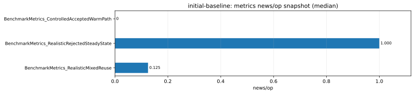

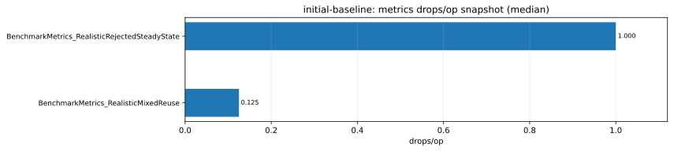

Counter summary:

| Benchmark | `news/op` | `drops/op` | `reuse_denials/op` | Scenario meaning |
| --- | --- | --- | --- | --- |
| `BenchmarkMetrics_ControlledAcceptedWarmPath` | `0` | `0` | `0` | warm accepted-path reference |
| `BenchmarkMetrics_RealisticRejectedSteadyState` | `1.0` | `1.0` | `1.0` | every operation constructs, rejects, and drops |
| `BenchmarkMetrics_RealisticMixedReuse` | `0.125` | `0.125` | `0.125` | every eighth operation crosses the rejection threshold |

- `BenchmarkMetrics_ControlledAcceptedWarmPath`: `~17.7 ns/op`, `0 B/op`,
  `0 allocs/op`, `0 news/op`.
  This is the warm accepted-path counter reference. It confirms that the steady
  accepted path can remain reuse-clean while still carrying explicit
  repository-specific metric reporting.
- `BenchmarkMetrics_RealisticRejectedSteadyState`: `~110.5 ns/op`,
  `288 B/op`, `2 allocs/op`, `1.0 news/op`, `1.0 drops/op`,
  `1.0 reuse_denials/op`.
  This is the always-rejected counter reference. Every iteration constructs,
  denies reuse, and drops exactly once, so the custom counters line up one-for-
  one with the benchmark's scenario definition.
- `BenchmarkMetrics_RealisticMixedReuse`: `~182.7 ns/op`, `1092.5 B/op`,
  `0 allocs/op`, `0.125 news/op`, `0.125 drops/op`, `0.125 reuse_denials/op`.
  This is the most informative counter benchmark in the report. The benchmark
  intentionally sends an oversized payload every eighth iteration, and the
  counters reflect exactly that: each policy event appears at `0.125/op`.
  The time and bytes surface show that an infrequent oversized path can still
  dominate the workload shape even when most iterations are accepted. The raw
  output rounds `allocs/op` to `0`, but the elevated `B/op` and the `0.125/op`
  lifecycle counters still make the periodic expensive path visible.

Metrics summary:
the custom counters behave coherently with the benchmark design.
They are useful because they expose why a path is expensive, but they still
need to be read together with time and allocation metrics.

## Interpretation

This report is a snapshot of the current benchmark surface, not a change
report.

The strongest conclusions supported by this snapshot are:

- pointer-like accepted reuse is the healthy primary path for the package;
- backend misses, lifecycle rejection, heavy reset work, and oversized values
  are all visibly more expensive than warm accepted reuse;
- the public runtime adds overhead over raw `sync.Pool`, but that overhead is
  easiest to justify on matched-shape baseline and parallel comparisons, not by
  comparing unrelated benchmark families;
- by-value and oversized shapes are the clearest cases where pooling does not
  look like the natural fit.

What this report does not establish:

- whether the current revision is better or worse than another revision;
- whether the package is universally beneficial for all `T`;
- whether controlled serial evidence predicts realistic parallel behaviour.

## Limits

- this is one current-state snapshot, not a revision comparison;
- no `benchstat` artifact is involved in the report;
- the snapshot was collected on one machine and one recorded toolchain;
- the snapshot reflects one host, one CPU, and one Go `1.25.9` toolchain;
- chart values are medians over repeated raw samples, so the report is a
  presentation summary rather than a raw-line dump;
- `BenchmarkCompare_*` cases were intentionally excluded from the default
  snapshot charts because they are report-grouping surfaces rather than a
  separate evidence class;
- the report embeds only the charts that best explain each family, not every
  chart artifact generated from the snapshot.

## Follow-up

- Keep this report as the baseline reference for future comparison reports.
- When a future revision changes one family materially, collect a second raw
  snapshot, compare the two with `benchstat`, and write a revision-to-revision
  report rather than extending this snapshot document.
- If one family becomes the focus of a deeper investigation, capture targeted
  CPU or memory profiles for that family and pair them with a comparison report
  instead of widening this snapshot report further.

## Continue with

| If your next question is... | Read |
| --- | --- |
| how this snapshot should have been collected | [Benchmark Methodology](../methodology.md) |
| how to interpret the chart and metric claims narrowly | [Benchmark Interpretation Guide](../interpretation-guide.md) |
| which benchmark families this report is built from | [Benchmark Matrix](../benchmark-matrix.md) |
| how to write the next repository report | [Reports Contract](./README.md) |
