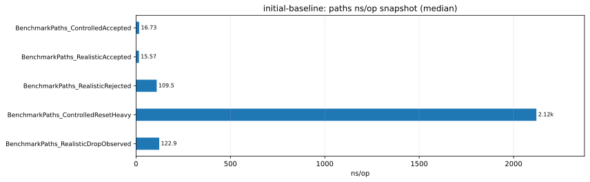

# Performance Reports

## Contents

- [What a Report Is](#what-a-report-is)
- [What Does Not Belong Here](#what-does-not-belong-here)
- [Chart Usage in Reports](#chart-usage-in-reports)
- [Relative Paths for Embedded Charts](#relative-paths-for-embedded-charts)
- [Recommended Report Structure](#recommended-report-structure)
- [Naming](#naming)

This directory contains curated, human-authored performance reports for
`arcoris.dev/pool`.

A report is the final narrative layer of the performance subsystem.
It links a concrete performance question to the supporting raw artifacts,
comparison artifacts, profiles, and charts that were used to answer it.

## What a Report Is

A committed report SHOULD:

- answer one specific performance question;
- identify the benchmark families and execution classes it relies on;
- link to the raw benchmark artifacts it used;
- link to compare artifacts when the report is comparative;
- link to profiles when profiles materially support the interpretation;
- state whether chart values come from comparison artifacts or from an
  aggregated raw snapshot summary such as per-benchmark medians;
- use charts as presentation artifacts, not as a replacement for raw evidence;
- state the narrowest conclusion justified by the evidence.

## What Does Not Belong Here

This directory is not for:

- scratch notes;
- throwaway smoke-run output;
- copied raw benchmark dumps;
- unfinished conclusions without supporting artifacts;
- methodology rules that belong in the
  [benchmark methodology guide](../methodology.md);
- benchmark inventory that belongs in the
  [benchmark matrix](../benchmark-matrix.md);
- interpretation rules that belong in the
  [benchmark interpretation guide](../interpretation-guide.md).

## Chart Usage in Reports

Reports MAY embed charts when the chart makes the evidence easier to read.
Charts are presentation artifacts only.

Reports MUST still point back to the underlying artifacts, such as:

- [Raw benchmark artifacts](../../../bench/raw/)
- [Comparison artifacts](../../../bench/compare/)
- [Profile artifacts](../../../bench/profiles/)

Good report chart usage:

- a small curated set of charts tied to the report question;
- per-section charts that match the benchmark family being discussed;
- explicit captions or nearby prose explaining what the chart family means.

Bad report chart usage:

- embedding every available chart;
- using charts without linking the underlying artifacts;
- treating a chart as if it were a statistical comparison by itself.

## Relative Paths for Embedded Charts

Reports in this directory sit three levels below the
[repository root](../../../).
Embedded chart paths therefore need the `../../../` prefix.

Example:

```md

```

Use the same rule for raw artifact links from reports:

```md
[initial-baseline.txt](../../../bench/raw/initial-baseline.txt)
```

## Recommended Report Structure

A report in this directory should usually include:

1. Title
2. Question
3. Scope
4. Environment
5. Evidence
6. Findings
7. Interpretation
8. Limits
9. Follow-up

## Naming

Use stable descriptive file names:

```text
YYYY-MM-DD-topic.md
```

Example:

- [`2026-04-21-initial-baseline.md`](./2026-04-21-initial-baseline.md)
